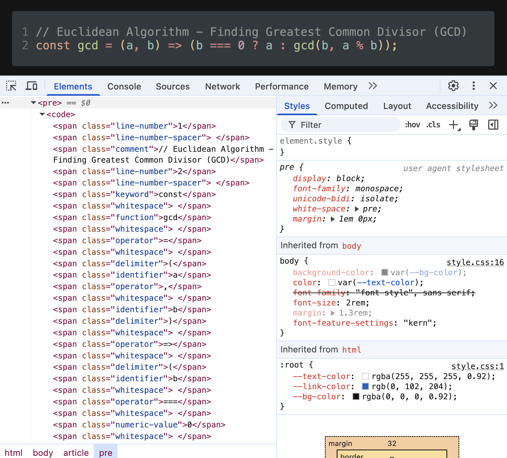

HTMLify
=======

This tool converts source-code to semantically-labelled HTML markup, mainly for the purposes of displaying source-code on webpages.

For example, the following JavaScript

```js
// Euclidean Algorithm - Finding Greatest Common Divisor (GCD)
const gcd = (a, b) => (b === 0 ? a : gcd(b, a % b));

```

Gets converted to

```html
<span class="comment">// Euclidean Algorithm - Finding Greatest Common Divisor (GCD)</span>
<span class="keyword">const</span><span class="whitespace"> </span><span class="function">gcd</span><span class="whitespace"> </span><span class="operator">=</span><span class="whitespace"> </span><span class="delimiter">(</span><span class="identifier">a</span><span class="operator">,</span><span class="whitespace"> </span><span class="identifier">b</span><span class="delimiter">)</span><span class="whitespace"> </span><span class="operator">=&gt;</span><span class="whitespace"> </span><span class="delimiter">(</span><span class="identifier">b</span><span class="whitespace"> </span><span class="operator">===</span><span class="whitespace"> </span><span class="numeric-value">0</span><span class="whitespace"> </span><span class="operator">?</span><span class="whitespace"> </span><span class="identifier">a</span><span class="whitespace"> </span><span class="operator">:</span><span class="whitespace"> </span><span class="function">gcd</span><span class="delimiter">(</span><span class="identifier">b</span><span class="operator">,</span><span class="whitespace"> </span><span class="identifier">a</span><span class="whitespace"> </span><span class="operator">%</span><span class="whitespace"> </span><span class="identifier">b</span><span class="delimiter">)</span><span class="delimiter">)</span><span class="delimiter">;</span>
```

The `class` attribute specifies the semantics of the token for the purposes of syntax highlighting via CSS.

**Note that currently the code is generated with the intent of placing it between `<pre>` tags!**

Below is an example of the semantically-labelled HTML being styled with some CSS:

*(I have to show it as an image as GitHub does not allow CSS in the rendering of HTML inside Markdown)*



Currently only JavaScript is supported. Might add Python support in the future...

Building
========

This tool is built with Cargo, I recommend building for release with

```shell
cargo build --release
```

Tests
=====

If for some reason you wish to run the tests:

```shell
cargo test
```

is sufficient.

Running
=======

Once the binary is built, a typical usage is:

```shell
htmlify --language js --source-file test.js
```

Note that line-numbers can be rendered by providing `--line-nums`.

To-Do/Future Considerations:
============================

* [ ] Add Python support
* [ ] Add more property-based tests
* [ ] Consider identifying the language automatically from the source file extension, if `--language` is not provided
* [ ] Should the user be able to specify different HTML tags, other than `<span>`?
* [ ] Add ability to read from `stdin`
